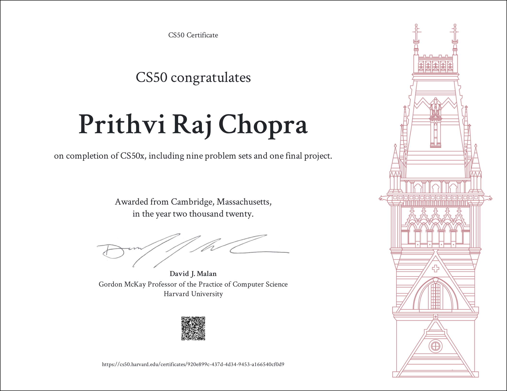

# This is CS50x
Introduction to the scholarly ventures of software engineering and the specialty of programming. This course shows understudies how to think algorithmically and tackle issues effectively. Points incorporate deliberation, calculations, information structures, epitome, asset the executives, security, and computer programming. Dialects incorporate C, Python, and SQL in addition to understudies' decision of: HTML, CSS, and JavaScript (for web advancement); Java or Swift (for portable application improvement); or Lua (for game turn of events). Issue sets roused by human expressions, humanities, sociologies, and sciences. Course comes full circle in a last venture. Intended for concentrators and non-concentrators the same, with or without earlier programming experience. 66% of CS50 understudies have never taken CS before. The course's general objectives are to motivate understudies to investigate new waters, unafraid of disappointment, make an escalated, shared insight, open to all understudies, and assemble network among understudies.

## Course Structure
| Week                                                     | Topics                            |
| ---------------------------------------------------------|:---------------------------------:|
| [Week 0](https://cs50.harvard.edu/x/2020/weeks/0/)       | Scratch                           | 
| [Week 1](https://cs50.harvard.edu/x/2020/weeks/1/)       | C                                 | 
| [Week 2](https://cs50.harvard.edu/x/2020/weeks/2/)       | Arrays                            | 
| [Week 3](https://cs50.harvard.edu/x/2020/weeks/3/)       | Alogrithms                        | 
| [Week 4](https://cs50.harvard.edu/x/2020/weeks/4/)       | Memory                            | 
| [Week 5](https://cs50.harvard.edu/x/2020/weeks/5/)       | Data Structures                   | 
| [Week 6](https://cs50.harvard.edu/x/2020/weeks/6/)       | Python                            | 
| [Week 7](https://cs50.harvard.edu/x/2020/weeks/7/)       | SQL                               | 
| [Week 8](https://cs50.harvard.edu/x/2020/weeks/8/)       | Web Track                         | 
| [Week 9](https://cs50.harvard.edu/x/2020/weeks/project/) | Final Project                     | 

# CS50x Certificate !

